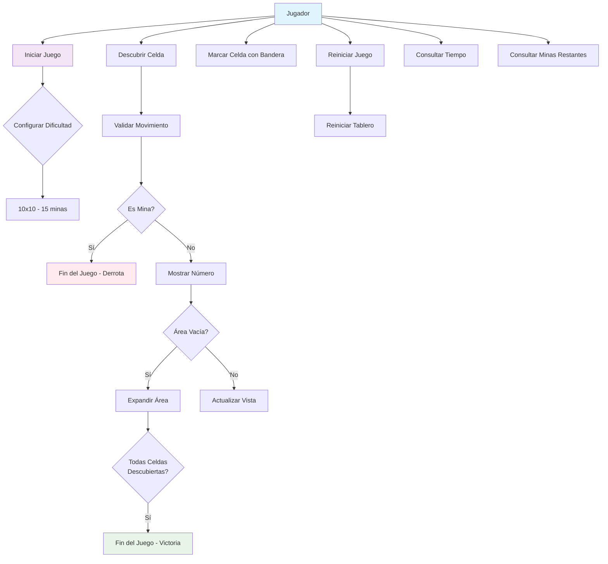
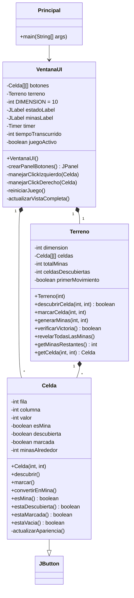
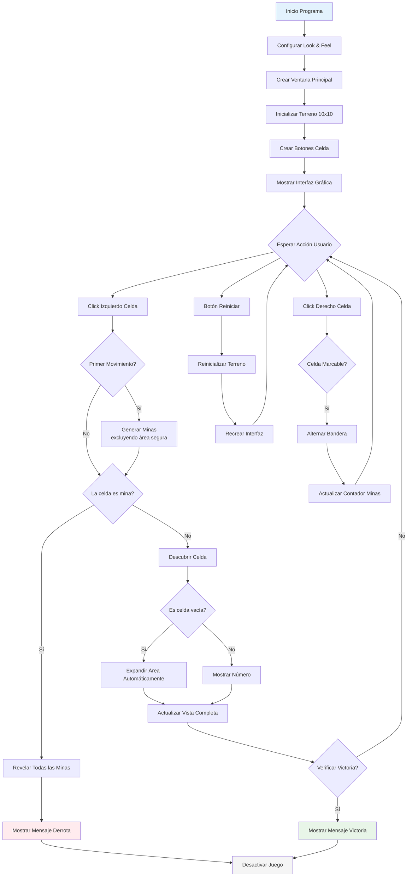

# Buscaminas en Java

Un juego clásico de Buscaminas implementado en Java con interfaz gráfica Swing.

## Características

- Tablero 10x10 con 15 minas
- Primer movimiento seguro
- Expansión automática de áreas vacías
- Sistema de banderas con click derecho
- Temporizador integrado
- Detección automática de victoria/derrota
- Reinicio completo del juego

## Estructura del Proyecto

```
buscaminas/
├── Principal.java          # Punto de entrada
├── VentanaUI.java          # Interfaz gráfica
├── Terreno.java            # Lógica del juego
└── Celda.java              # Representación de celdas
```

## Cómo Ejecutar

```bash
# Compilar todos los archivos
javac *.java

# Ejecutar el juego
java Principal
```

## Diagramas UML

### 1. Diagrama de Casos de Uso



### 2. Diagrama de Clases



### 3. Diagrama de Actividades


