# Buscaminas en Java

```mermaid
config:
  theme: default
```

Un juego clásico de Buscaminas implementado en Java con interfaz gráfica Swing.

## Características

- ✅ Tablero 10x10 con 15 minas
- ✅ Primer movimiento seguro
- ✅ Expansión automática de áreas vacías
- ✅ Sistema de banderas con click derecho
- ✅ Temporizador integrado
- ✅ Detección automática de victoria/derrota
- ✅ Reinicio completo del juego

## Estructura del Proyecto

```
buscaminas/
├── Principal.java          # Punto de entrada
├── VentanaUI.java          # Interfaz gráfica
├── Terreno.java            # Lógica del juego
└── Celda.java              # Representación de celdas
```

## Cómo Ejecutar

```bash
# Compilar todos los archivos
javac *.java

# Ejecutar el juego
java Principal
```

## 📊 Diagramas UML

### 1. Diagrama de Casos de Uso

```mermaid
graph TD
    A[Jugador] --> B[Iniciar Juego]
    A --> C[Descubrir Celda]
    A --> D[Marcar Celda con Bandera]
    A --> E[Reiniciar Juego]
    A --> F[Consultar Tiempo]
    A --> G[Consultar Minas Restantes]
    
    B --> H{Configurar Dificultad}
    H --> I[10x10 - 15 minas]
    
    C --> J[Validar Movimiento]
    J --> K{Es Mina?}
    K -->|Sí| L[Fin del Juego - Derrota]
    K -->|No| M[Mostrar Número]
    
    M --> N{Área Vacía?}
    N -->|Sí| O[Expandir Área]
    N -->|No| P[Actualizar Vista]
    
    O --> Q{Todas Celdas<br>Descubiertas?}
    Q -->|Sí| R[Fin del Juego - Victoria]
    
    E --> S[Reiniciar Tablero]
    
    style A fill:#e1f5fe
    style L fill:#ffebee
    style R fill:#e8f5e8
    style B fill:#f3e5f5
```



### 2. Diagrama de Clases


### 3. Diagrama de Actividades

```mermaid
graph TD
    A[Inicio Programa] --> B[Configurar Look & Feel]
    B --> C[Crear Ventana Principal]
    C --> D[Inicializar Terreno 10x10]
    D --> E[Crear Botones Celda]
    E --> F[Mostrar Interfaz Gráfica]
    F --> G{Esperar Acción Usuario}
    
    G --> H[Click Izquierdo Celda]
    G --> I[Click Derecho Celda]
    G --> J[Botón Reiniciar]
    
    H --> K{Primer Movimiento?}
    K -->|Sí| L[Generar Minas<br>excluyendo área segura]
    K -->|No| M
    
    L --> M{La celda es mina?}
    M -->|Sí| N[Revelar Todas las Minas]
    N --> O[Mostrar Mensaje Derrota]
    O --> P[Desactivar Juego]
    
    M -->|No| Q[Descubrir Celda]
    Q --> R{Es celda vacía?}
    R -->|Sí| S[Expandir Área Automáticamente]
    R -->|No| T[Mostrar Número]
    
    S --> U[Actualizar Vista Completa]
    T --> U
    
    U --> V{Verificar Victoria?}
    V -->|Sí| W[Mostrar Mensaje Victoria]
    W --> P
    V -->|No| G
    
    I --> X{Celda Marcable?}
    X -->|Sí| Y[Alternar Bandera]
    Y --> Z[Actualizar Contador Minas]
    Z --> G
    
    J --> AA[Reinicializar Terreno]
    AA --> BB[Recrear Interfaz]
    BB --> G
    
    style A fill:#e3f2fd
    style P fill:#f5f5f5
    style O fill:#ffebee
    style W fill:#e8f5e8
```



