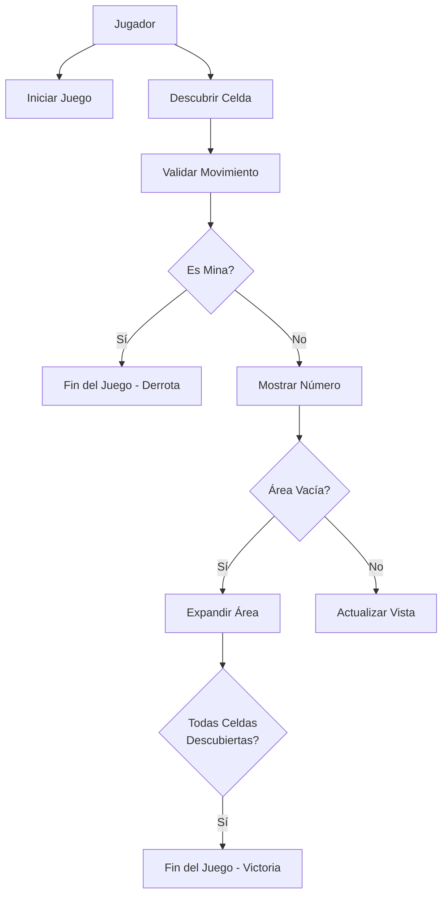
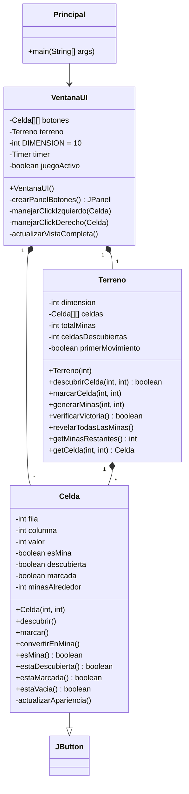
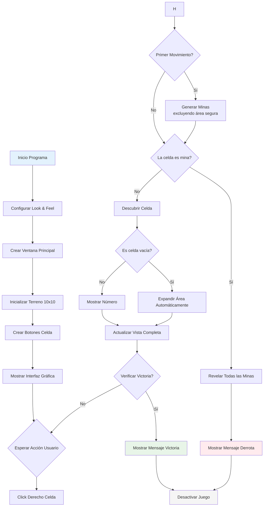

# Buscaminas en Java

Un juego clásico de Buscaminas implementado en Java con interfaz gráfica Swing.

## Características

1. Tablero 10x10 con 15 minas
2. Primer movimiento seguro
3. Expansión automática de áreas vacías
4. Sistema de banderas con click derecho
5. Temporizador integrado
6. Detección automática de victoria/derrota
7. Reinicio completo del juego

## Estructura del Proyecto

```
buscaminas/
├── Principal.java          # Punto de entrada
├── VentanaUI.java          # Interfaz gráfica
├── Terreno.java            # Lógica del juego
└── Celda.java              # Representación de celdas
```

## Cómo Ejecutar

```bash
# Compilar todos los archivos
javac *.java

# Ejecutar el juego
java Principal
```

## Diagramas UML

### 1. Diagrama de Casos de Uso



EXPLICACIÓN DEL DIAGRAMA:

Casos de Uso Principales:

INICIAR JUEGO

    Propósito: Configurar y comenzar nueva partida
    
    Flujo: Crea tablero 10x10 con 15 minas (15% densidad)
    
    Precondición: Aplicación ejecutándose

DESCUBRIR CELDA

    Propósito: Revelar contenido de celda con click izquierdo
    
    Flujo Complejo:
    
    Si es primer movimiento → genera minas excluyendo área segura
    
    Si es mina → fin del juego (derrota)
    
    Si es número → muestra número con color específico
    
    Si es vacía (0) → expande área automáticamente

MARCAR CELDA CON BANDERA

    Propósito: Marcar/desmarcar minas sospechosas con click derecho
    
    Precondición: Celda no descubierta
    
    Efecto: Actualiza contador de minas restantes
    
    RELACIONES PRINCIPALES:
    Inclusión: Descubrir Celda incluye Validar Movimiento
    
    Extensión: Descubrir Celda puede extenderse a Expandir Área
    
    Generalización: Dificultad fija en 10x10

CARACTERÍSTICAS CLAVE:

    
    1.-Expansión automática: Áreas vacías se descubren automáticamente
    
    2.-Feedback inmediato: Colores diferentes para cada número
    


### 2. Diagrama de Clases



EXPLICACIÓN DEL DIAGRAMA:

Arquitectura Modelo-Vista:

Modelo (Terreno): Lógica del juego y estado del tablero

Vista (VentanaUI): Interfaz gráfica y presentación

Controlador: Integrado en VentanaUI (manejo de eventos)

Clases Principales:

VENTANAUi - Capa de Presentación

Gestiona toda la interfaz gráfica

Controla eventos de mouse y teclado

Coordina actualizaciones visuales

TERRENO - Capa de Lógica

Administra el estado del juego

Contiene la matriz de celdas

Implementa reglas del Buscaminas

CELDA - Componente Base

Representa cada posición del tablero

Hereda de JButton para integración Swing

Auto-gestiona su apariencia visual

RELACIONES PRINCIPALES:

1.-Composición Fuerte: VentanaUI contiene Terreno y Celdas (si se destruye la ventana, se destruye todo)
2.-Agregación: Terreno contiene Celdas pero pueden existir independientemente
3.-Herencia: Celda extiende JButton para funcionalidad de botón

CARACTERÍSTICAS CLAVE:

1.-Encapsulamiento: Cada clase tiene responsabilidades bien definidas
2.-Acoplamiento bajo: Las clases se comunican through interfaces claras
3.-Cohesión alta: Cada clase tiene un propósito específico
4.-Extensibilidad: Fácil agregar nuevas características


### 3. Diagrama de Actividades



EXPLICACIÓN DEL DIAGRAMA:
Flujo Principal del Juego:

INICIALIZACIÓN 

Configuración del entorno gráfico
Creación del modelo de datos (Terreno)
Construcción de la interfaz

BUCLE PRINCIPAL

Estado de espera constante por input del usuario
Tres tipos de acciones posibles

GESTIÓN DE EVENTOS 

Procesos Clave:

Generación Inteligente de Minas :

Excluye celda del primer click y sus 8 vecinos
Garantiza juego justo desde el inicio

Expansión Recursiva:

Algoritmo que descubre automáticamente áreas contiguas vacías
Mejora experiencia de usuario

Verificación de Victoria:

Fórmula: celdasDescubiertas == (totalCeldas - totalMinas)
Detección automática sin intervención del usuario

TRANSICIONES CRÍTICAS:

Primer Movimiento: Activa generación segura de minas
Descubrimiento de Mina: Transición a estado de derrota
Expansión Completa: Posible transición a victoria
Reinicio: Ciclo completo de reinicialización

CARACTERÍSTICAS CLAVE:

Flujo Continuo: Bucle infinito hasta victoria/derrota
Manejo de Estados: Transiciones claras entre estados del juego
Recursividad: Expansión de áreas usa llamadas recursivas
