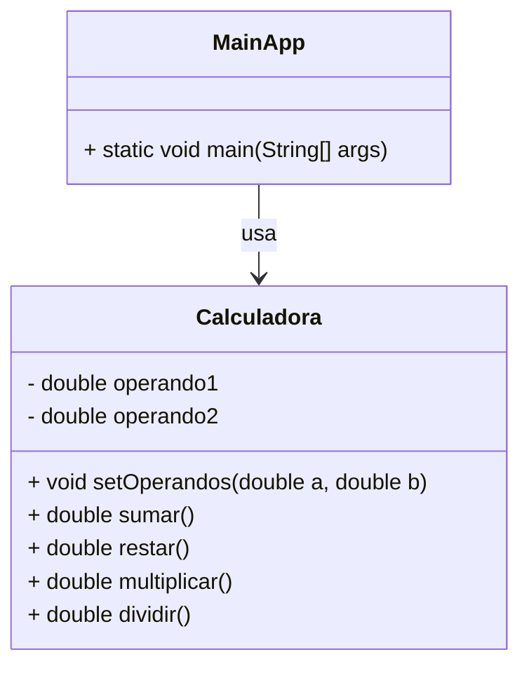

# Calculadora POO en Java

Este es un proyecto sencillo de **Programación Orientada a Objetos (POO)** en Java.  
Implementa una calculadora básica que opera con **dos operandos** y permite realizar las operaciones matemáticas básicas: **suma, resta, multiplicación y división**.

---

## 📚 Descripción del Proyecto

La calculadora está diseñada siguiendo los principios de **POO**:

- Encapsulamiento de datos (los operandos son privados).
- Métodos públicos para realizar operaciones.
- Un punto de entrada (`Principal`) que muestra cómo usar la clase `Calculadora`.

Este proyecto es ideal para **aprender POO en Java** de forma sencilla.

---

## 🛠️ Clases del Proyecto

El proyecto tiene dos clases principales:

- **Calculadora**  
  Contiene los atributos y métodos para establecer operandos y realizar operaciones matemáticas básicas.

- **Principal**  
  Es la clase con el método `main` para ejecutar y probar la calculadora desde consola.

### Diagrama de Clases (Mermaid)



---

## 🚀 Cómo ejecutar el proyecto

### 1. Requisitos previos
- Tener **Java JDK 21 o superior** instalado.
- Tener configurada la variable de entorno `PATH` para que `java` y `javac` funcionen desde la terminal.

Para comprobarlo:

```bash
java -version
javac -version
```

### 2. Actualiza el repositorio
Descarga o clona este repositorio `programacion-avanzada`:

```bash
git fetch
git pull
```

### 3. Compilar el proyecto

```bash
javac Calculadora.java Principal.java
```

Esto genera los archivos `.class` (bytecode) en el mismo directorio.

### 4. Ejecutar el proyecto

```bash
java Principal
```

Deberías ver la salida de las operaciones matemáticas en la consola.

---

## 📝 Explicación rápida

1. **Calculadora.java**:  
   Contiene los dos operandos (`operando1` y `operando2`) y métodos para operar con ellos.  
   Antes de usar cualquier operación, debes llamar a `colocarOperandos(a, b)` para asignar valores.

2. **MainApp.java**:  
   Crea una instancia de `Calculadora`, asigna dos operandos y muestra los resultados de las operaciones en consola.

---

## 🖥️ Ejemplo de uso

```java
public class MainApp {
    public static void main(String[] args) {
        Calculadora calc = new Calculadora();
        calc.setOperandos(10, 5);

        System.out.println("Suma: " + calc.sumar());
        System.out.println("Resta: " + calc.restar());
        System.out.println("Multiplicación: " + calc.multiplicar());
        System.out.println("División: " + calc.dividir());
    }
}
```

Salida esperada:

```
Suma: 15.0
Resta: 5.0
Multiplicación: 50.0
División: 2.0
```

---

## 📄 Licencia
Este proyecto es de uso educativo y libre de modificar.
